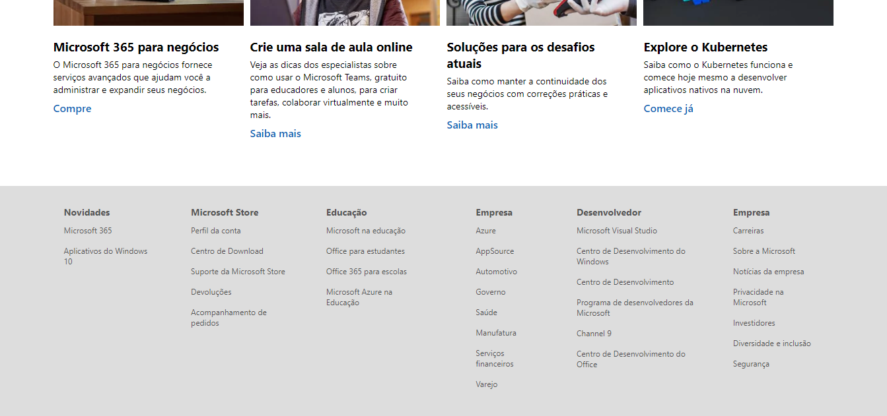

# Microsoft UI Clone

An UI clone of Microsoft official website made for study purposes.

## Made with

* [ReactJS](https://reactjs.org/)
* [Styled Components](https://styled-components.com/)
* [Typescript](https://www.typescriptlang.org/)
* [Yarn](https://yarnpkg.com/)

## Screenshots

<center>
<span>


</span>
</center>

## How to use

```bash
# clone this repository
git clone 

# install the dependencies
npm install / yarn install

# run the app
npm start / yarn start
```