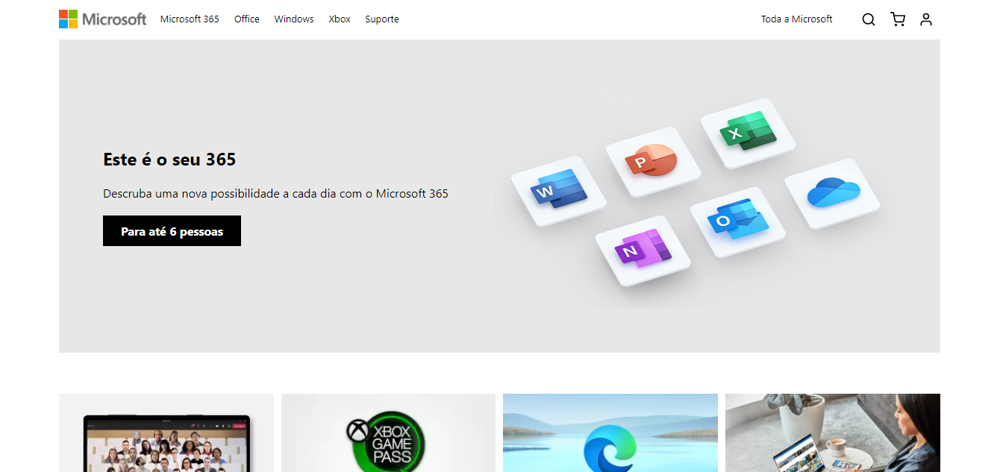

# Microsoft UI Clone

An UI clone of Microsoft official website made for study purposes.

## Made with

* [React](https://reactjs.org/)
* [Typescript](https://www.typescriptlang.org/)
* [Yarn](https://yarnpkg.com/)

## Screenshots

<center>
<span>


</span>
</center>

## How to use

#### Clone this repository
```bash
git clone https://github.com/fredcoutinho52/microsoft-ui-clone.git
```

#### Install the dependencies
```bash
yarn install
```

##### Run the app
```bash
yarn start
```
